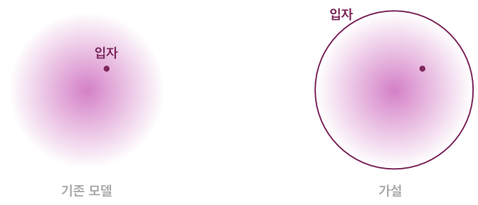
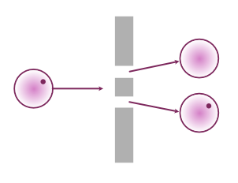
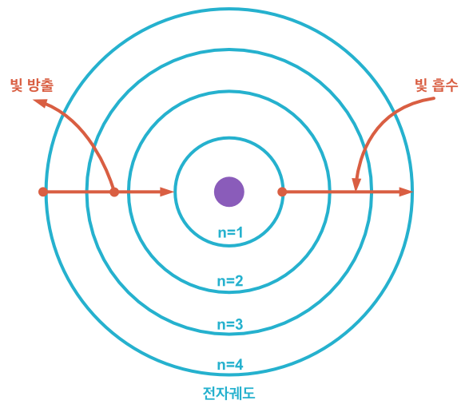
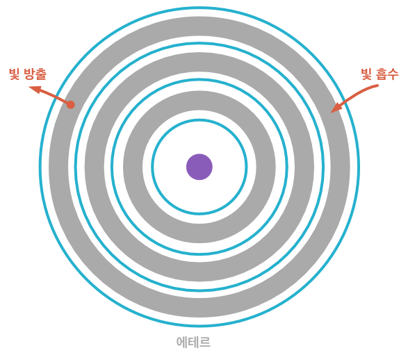

# 물질의 공간성과 시간성에 대한 가설
에테르-스파클 합성체로서의 물질과 에테르 독립적 스파클으로서의 광자

수진 sujin.2f@gmail.om

2022

## 가설
본 가설은 하나의 의문에서 출발한다. 왜 누구도 입자의 확률 공간에 의미를 두지 않는가? 이 문서에서는 입자의 확률 공간을 입자의 일부로 보는 가설을 소개한다.

 

그림1. 가설

### 질량 공간인 에테르와 광자 혹은 그에 준하는 스파클
전자의 이중슬릿 실험을 가설에 맞추어 재구성 해보자. 전자는 두 슬릿을 동시에 통과하며, 두 슬릿 중 한 곳에서만 관측된다. 전자가 공간이라는 가설을 적용하면 전자의 공간이 두 슬릿에 의해 분리가 되었다고 가정할 수 있다. 전자라는 공간은 우리가 공간이라 부르는 삼차원 좌표계에서 두 개로 나뉘었지만 관측 시점에서 입자는 한 곳에서만 나타난다. 이것은 전자의 공간이 두 개로 나뉘어질 수 있음과 동시에 해당 공간 속의 입자는 나뉘어지기 전과 똑같이 행동한다고 해석할 수 있다. 즉, 입자는 물리적으로 분리된 두 공간을 자유로이 넘나들지만 입자의 관점에서 봤을 때에는 여전히 한 공간에서 움직이고 있는 것이다. 그렇다면 전자의 공간은 우리가 아는 좌표계로서의 공간이 아닌 다른 무언가이다. 이를 에테르(ether)라 부르고, 우리가 입자라고 생각해왔던 것을 스파클(sparkle)이라 부르기로 하자. 확률 공간을 입자의 일부로 보는 가설은 이제 물질이 에테르와 스파클의 합성체라는 가설이 되었다.

 

그림2. 이중슬릿 실험의 가설 적용

그렇다면 에테르와 스파클은 각각 어떤 성질을 가지고 있을까? 광자와 전자의 비교를 통해 유추해 보고자 한다. 입자이자 파동인 두 물질은 비슷한 성질을 가지고 있지만 질량과 속력이라는 측면에서 다른 성질을 보인다. 에테르를 질량으로 생각하고 스파클을 광자, 혹은 그에 준하는 물질로 가정해 보자. 광자는 에테르(질량)를 가지지 않은 스파클이다. 광자의 공간은 우주 전체이고 그 속력은 관성계와 상관 없이 불변한다. 반면, 전자 속 스파클의 우주는 질량을 가진 에테르이다. 질량에 갖혀있는 스파클은 더 느린 속력을 가질 것이다. 광자가 다른 물질에 비해 불변의 속력을 가진 것은 독립적 스파클이 우주라는 공간 속에서 가지는 특서일 것이며, 전자 속의 스파클은 전자 에테르 속에서 역시 동일한 성질로 존재할 것이다.

에테르와 스파클의 또 다른 특징은 관측 가능성에 있다. 과학은 지금까지 스파클만을 관측했다. 에테르의 존재를 가정한다면, 에테르는 관측 불가능한 것이 된다.
 
### 스파클 독립적 에테르 - 보어의 원자 모형에서
위에서 에테르-스파클 합성체로서의 물질과 에테르 독립적 스파클인 광자를 가정하였다. 그렇다면 광자의 반대 개념인 스파클 독립적 에테르가 존재할 수 있을지 의문을 가지게 된다. 앞선 가정에 의하여 에테르는 관측 불가능하다.

관측이 불가능한 스파클 독립적 에테르가 무엇인지 유추하기 위해 닐스 보어의 원자 모형을 살펴보도록 하겠다.

 

그림3. 보어의 원자 모형

특정 파장의 광자를 흡수한 전자는 그 궤도가 n이라는 정수만큼 증가하며, 해당 파장의 광자를 방출할 때 궤도는 감소한다. 여기서 에테르 독립적 스파클인 광자가 $E=m {c^{2}}$에 의하여 스파클 독립적 에테르로 변화하여 궤도 사이에 들어가는 것으로 생각의 틀을 바꿔보도록 하자.

 

그림4. 빛 에테르 가설

광자라는 스파클은 해당하는 에너지 만큼의 에테르-질량으로 전환되어 원자핵과 전자 사이에 위치하게 된다. 반대로 에너지를 방출할 때에는 에테르가 스파클로 전환되어 광자의 형태로 방출되는 것이라 가정해 보도록 하자.

## 가설의 검증
### 보어의 원자 모형에 기초한 방출 에너지

전자가 방출하는 파장은 뤼드베리 공식으로 구할 수 있다. 아래는 뤼드베리 공식과 $n \geqq 2$에서 $n=1$로 준위가 떨어질 때 방출되는 빛의 파장인 라이먼 계열과 $n \geqq 4$에서 $n=3$으로 변화하는 파센 계열의 방출 파장을 정리한 것이다.

$$\dfrac{1}{\lambda} = R(\dfrac{1}{1^2} - \dfrac{1}{n^2})$$

식1. 뤼드베리 공식 $(R=1.0974 \times 10^7 m^2)$

| n | 2 | 3 | 4 | 5 | 6 | 7 | 8 |
|--|--|--|--|--|--|--|--|
| 파장 | 121.50 | 102.51 | 97.20 | 94.92 | 93.73 | 93.02 | 92.57 |

표1. 라이먼 계열의 방출 파장 (nm)

| n | 4 | 5 | 6 | 7 | 8 |
|--|--|--|--|--|--|
| 파장 | 1,874.60 | 1,281.46 | 1,093.52 | 1,004.67 | 954.34 |

표2. 파센 계열의 방출 파장 (nm)

언뜻 보면 같은 계열 사이에서는 수치가 줄어드는 규칙이 있는 듯 하지만 다른 계열 사이에서는 어떤 방식으로 값이 변화하는지 알아 보기 힘들다. 4에서 3으로 가는 수치를 라이먼 계열의 값만으로는 유추하기 힘들다는 것이다. 우리는 n껍질 사이의 공간이 일정한 값을 가지기 원하기 때문에 파장은 적절한 수치로 보이지 않는다. 라이먼 계열의 파장을 그 역수인 파수로 바꾸어 표현하면 아래와 같다.

| n | 2 | 3 | 4 | 5 | 6 | 7 | 8 |
|--|--|--|--|--|--|--|--|
| 파수 | 82,302.98 | 97,544.28 | 102,878.73 | 105,347.82 | 106,689.05 | 107,497.77 | 108,022.67 |

표3. 라이먼 계열의 방출 파수 ( $c {m^{−1}}$ )

파수의 간극을 보기로 하자. 즉, 2번에서 1번으로, 3번에서 4번으로 이동할 때의 값을 살펴보는 것이다.

| n | $3 \to 2$ | $4 \to 3$ | $5 \to 4$ | $6 \to 5$ | $7 \to 6$ | $8 \to 7$ |
|--|--|--|--|--|--|--|
| 파수 차이 | 15,241.29 | 5,334.45 | 2,469.08 | 1,341.23 | 808.72 | 524.89 |

표4. 라이먼 계열의 파수 차이 ( $c {m^{−1}}$ )

| n | $5 \to 4$ | $6 \to 5$ | $7 \to 6$ | $8 \to 7$ |
|--|--|--|--|--|
| 파수 차이 | 2,469.08 | 1,341.23 | 808.72 | 524.89 |

표5. 파센 계열의 파수 차이 ( $c {m^{−1}}$ )

파수의 차이는 두 계열에서 동일하다. n껍질 사이의 공간에 특정한 에너지가 에테르의 형태로 보존된다는 가설을 뒷받침해 준다. 각 껍질과 껍질 사이에 해당하는 빛 에테르는 일정한 에너지를 가지고 있고, 딱 그 에너지 만큼의 빛 스파클로 전환되어 방출되는 것으로 해석할 수 있다.

 

그림5. 빛 에테르가 가진 파장

### 빛 에테르의 에너지
빛 에테르가 일정한 파장을 가지고 있다면 그 에너지를 구할 수 있을 것이다. 빛의 에너지는 $E=h\dfrac{c}{\lambda}$의 식으로 구할 수 있다. 최종적으로 eV를 단위로 갖는 에너지 값은 $E=Rhc(\dfrac{1}{(n-1)^2} - \dfrac{1}{n^2})\cdot6.242\cdot10^{32}$이며, 이를 정리하면 아래와 같다.

| n | 1-2 | 2-3 | 3-4 | 4-5 | 5-6 | 6-7 | 8-8 |
|--|--|--|--|--|--|--|--|
| E | 10.2050 | 1.8898 | 0.6614 | 0.3061 | 0.1663 | 0.1002 | 0.0650 |

표6. 방출 파장에 따른 에너지 가설 (eV)

보어 원자 모형과 수소 원자의 슈뢰딩거 방정식에서 n번째 껍질의 에너지는 다음의 수식을 만족한다.

$$E_n = \frac{ℏ^2}{2 \mu a_0 ^ 2} \frac{1}{n^2}$$

식2. 각 준위(n)에 따른 전자의 에너지

여기서 $\frac{1}{n^2}$을 $\frac{1}{(n-1)^2} - \frac{1}{n^2}$으로 치환하고, J를 eV로 바꾸면 표6과 거의 일치하는 것을 알 수 있다.

$$E_n = \frac{ℏ^2}{2 \mu a_0 ^ 2} (\frac{1}{(n-1)^2} - \frac{1}{n^2})$$

식3. 준위차에 따른 전자의 에너지 가설 $n \geqq 2$

| n | 1-2 | 2-3 | 3-4 | 4-5 | 5-6 | 6-7 | 8-8 |
|--|--|--|--|--|--|--|--|
| 표6 | 10.2050 | 1.8898 | 0.6614 | 0.3061 | 0.1663 | 0.1002 | 0.0650 |
| E | 10.2009 | 1.8890 | 0.6611 | 0.3060 | 0.1662 | 0.1002 | 0.0650 |

표7. 준위차에 따른 전자의 에너지 가설 (eV)

뤼드베리 방정식에 의해 도출된 방출 파장으로 계산한 에너지와 보어 원자 모형/ 슈뢰딩거 방정식에서의 에너지 값을 변환한 값이 이렇게 일치하는 것은 이것을 껍질 사이의 에너지, 즉, 에테르의 에너지로 보기에 충분한 근거가 된다. 여기까지의 계산은 모두 이곳에 정리되어 있다. https://www.desmos.com/calculator/wagbooyuoc

### 슈뢰딩거 방정식과 오비탈로 보는 빛 에테르
이렇게 구해진 에너지로 빛-에테르의 슈뢰딩거 방정식을 만들고, 기존의 슈뢰딩거 방정식으로 표현되는 수소 원자 모델과 그 시각적 결과인 오비탈과 비교하여 가설을 검증하도록 하겠다.

그림6. [전자 오비탈](https://en.wikipedia.org/wiki/Atomic_orbital)

가설에 따르면 전자는 그저 존재할 뿐이며 빛-에테르는 전자와 원자핵 사이의 공간에 들어오는 것이다. 오비탈에서 검은 부분을 마디(node)라 하는데, 이 부분이 빛의 에테르일 것이다. 주 양자수 n에 따라 원형 에테르의 개수가 증가하고 부양자수 $l$에 따라 원형의 에테르 하나가 선형으로 변화하는 것으로 생각해볼 수 있다. 빛 에테르 분포가 전자 오비탈의 마디와 일치한다면 오비탈의 마디는 사실 빛 에테르라는 것을 검증할 수 있을 것이다. 마디의 위치는 슈뢰딩거 방정식의 R(r) 방정식으로 알아볼 수 있다.

$$R''(r) + \frac{2}{r} R'(r) + \frac{2 \mu}{ℏ^2} (E-V(r))R(r) + \frac{l(l+1)}{r^2}R(r) = 0$$

식5. 슈뢰딩거 방정식 중 R 방정식

상수항을 제외하고 알아야 할 것들은 세 가지가 있다. 질량인 $\mu$와 에너지 E, 그리고 퍼텐셜 에너지인 V(r)이 그것이다. 우리는 이미 에너지와 질량을 가정했으니 퍼텐셜 에너지를 구해야 한다.

원래 수소 원자 모델의 슈뢰딩거 방정식을 유도할 때는 반대의 경우에 처한다. 질량과 퍼텐셜 에너지를 알지만 에너지를 모르는 것이다. 에너지는 방정식을 풀어나가는 중에 유도하게 되며 이 결과는 식2와 일치하게 된다. 원래의 V(r)은 구심력인 쿨롱힘과 원심력인 각운동량이 평형을 이룬다는 것을 전제로 도출하게 된다. 우리가 구하려는 빛 에테르는 전하량이 없을 것이므로 쿨롱힘이 존재하지 않을 것이다. 남는 각운동량을 V(r)로 가정하는 것으로 시작해 보자. 각운동량의 유도는 아래와 같다.

$$V(r) = mr \omega ^2 = mr (2 \pi v)^2 = mr (2 \pi \frac{E}{h})^2 = mr (\frac{E}{ℏ})^2$$

식6. V(r) 가설

이렇게 구해진 질량, 에너지, 퍼텐셜 에너지를 슈뢰딩거 방정식에 넣으면, 그래프가 미쳐 날 뛴다. 기대하는 결과가 아니다.

끝.

이 아니고, 전자 오비탈의 에너지 유도 방법을 살펴 보기로 하자. 기존의 유도 과정에서 $l$이 정수라는 특성 상 해를 구하기 위해서는 $\sqrt{V의 일부} \times \frac{1}{\sqrt{E}}=2n$이라는 양자화 조건이 붙게 된다. 여기서 2n은 E 값의 $\frac{1}{4 n^2}$으로 변환되어 들어간다. 빛의 에테르에서는 에너지를 먼저 구하고 V(r) 값을 가정하였다. 미지의 V(r) 값을 가정으로 끌어 냈으니, 이 값은 양자화 조건을 만족해야 한다. 식6에서 가정한 V(r)에서는 m(질량)과 E(에너지)가 포함되어 있으니 n 값이 들어가 있지만 이는 정수가 아닌 $\dfrac{1}{(n-1)^2} - \dfrac{1}{n^2}$이다 (N(n)으로 표시하기로 하자). 이 값을 정수로 만들어줄 수식을 곱해주어야 조건을 만족할 것이다. m에 한 번, E 제곱에 한 번 포함되어 있으니 세제곱을 해주어야 한다. 그러나 V의 일부가 포함되는 것 처럼 에테르에서는 E의 일부도 들어갈 것이며, E 역시 n이 포함된 수식을 가지고 있다. 따라서 $\sqrt{N(n)} \times \frac{1}{\sqrt{N(n)}^3}=2n$이 양자화 조건이 된다.

$$\frac{1}{\sqrt{\dfrac{1}{(n-1)^2} - \dfrac{1}{n^2}}^2} x=2n$$

$$x=(\dfrac{1}{(n-1)^2} - \dfrac{1}{n^2}) \times 2n$$

식7,8. 양자화 조건에 따른 V(r) 보정

2n이 $\frac{1}{4 n^2}$이 된 것과 같이 $\frac{1}{x^2}$이 원하는 값이다. 따라서 결과는 아래와 같다.

$$V(r) = mr (\frac{E}{ℏ})^2 \frac{1}{((\dfrac{1}{(n-1)^2} - \dfrac{1}{n^2}) \times 2n)^2}$$

식9. 보정에 따른 V(r)

이제 다시 대입하여 해를 구해보도록 하자. 원래의 유도 방식은 르장드르 다항식을 이용해서 도출한 해와 규격화를 통해 결과를 풀어내지만, 아직 그럴 능력이 되지 않아 이계도 미분방정식을 푸는 가장 간단한 방식인 근의 공식을 이용하도록 하겠다. 빛의 에테르는 전자 오비탈과는 달리 마디를 가지지 않은 하나의 덩어리이기 때문에 완벽하지는 않지만 가능한 방법으로 볼 수 있다.

$$R''(r) + \frac{2}{r} R'(r) + \frac{2 \frac{E_n}{c^2}}{ℏ^2} (- E_n - mr (\frac{E_n}{ℏ})^2 \frac{1}{((\dfrac{1}{(n-1)^2} - \dfrac{1}{n^2}) \times 2n)^2})R(r) + \frac{l(l+1)}{r^2}R(r) = 0$$

식10. 빛 에테르의 R 방정식

여기서 기대하는 결과는 기존의 오비탈의 마디와 빛 에테르의 고점이 일치하는 것이다. 그렇다면 가설로 세운 전자와 원자핵 사이에 빛 에테르가 들어가는 것이 성립하게 된다. 그 결과는 [이곳](https://www.desmos.com/calculator/zk3so23nuz)에서 확인할 수 있다. 엄밀함을 가하기 위해 상수들은 실제 값을 사용하였으며, 근의 공식을 이용한 n=1 오비탈과 르장드르 다항식을 이용한 n=1 오비탈의 비율을 맞추어 놓았다. 두 비율이 다른 것은 정규화 상수 때문이며, 여기서 중요한 것은 세로 비율이 아닌, 마디의 위치이기 때문에 단순히 특정 값을 곱해 비율을 조정해도 무리가 없다. 또한 두 오비탈의 형태가 일치하는 것으로 보아 근의 공식으로 유도한 빛 에테르 역시 근사하는 결과가 나올 것으로 예상할 수 있다.

결과에서 $r_1$에서 $r_5$는 전자 오비탈이며 각 마디마다 보라색 파선을 표시하였다. 가장 처음에 나타나는 $R_{10}$이 기존의 방정식을 근의 공식으로 풀어낸 해이며, 이것과 $r_1$을 일치 시킴으로 $r_2$에서 $r_5$ 역시 일치한다고 볼 수 있는 근거가 된다. $R_{ether}$가 바로 위에서 구한 질량, 에너지, 퍼텐셜 에너지를 넣은 빛 에테르이다. 역시 비율 보정을 위해 $\frac{1}{n^2}$을 넣었다.

결과는 놀랍도록 일치한다. (그러나 별로 놀랍지 않게 오차도 존재한다.) 보라색 파선인 마디와 주황색 실선인 빛 에테르의 고점의 위치가 근사하는 것을 확인할 수 있다.

 

그림6. 전자 오비탈 마디의 위치와 빛 에테르 그래프

## 결론
본 가설은 매우 과격한 주장을 담고 있으며 수학적 능력 부족으로 아직 완전히 엄밀하다고 말할 수는 없다. 그러나 그 가설이 옳을 수도 있다는 아주 작은 가능성을 열어준다.

가설이 옳다면 우리가 아는 입자는 기존의 모델과 완전히 다른 것이 된다. 질량은 우리가 확률 공간으로 알고 있었던 질량 공간이 되며 관측할 수 없는 것이 된다. 우리가 아는 광자는 에테르 속 스파클과 동일한 존재가 된다. 물질이 에테르-스파클 합성체라면 전자기파는 스파클, 그리고 암흑물질은 에테르로 가정할 수 있게 된다. 그리고 우리라는 물질은 암흑 물질을 포함하고 있는 것이 된다.

## 한계점, 향후 과제, 그리고 또 다른 가설
### 한계점과 향후 과제
앞서 내용에서도 보였듯, 방정식의 유도 과정이 매우 원시적이다. 정규화 상수를 정확히 구함으로 그래프의 비율을 확정해야 한다. 가장 기대되는 결과는 이렇게 구해진 방정식을 적분하면 각각의 에테르의 질량과 일치하는 것이다. 전자 오비탈에서는 모든 상황의 적분 값이 동일하다. 확률 분포를 질량으로 해석한다면 전자의 질량은 어떤 모양이 되더라도 불변한다는 것이다. 또 다른 한계점은 오차이다. 그래프에서 보이듯 n=5 부터 눈에 띄는 오차가 생긴다는 것이다. 이 오차가 허용 범위에 속해있는지 검증이 필요하다. 마지막 한계점은 부양자수 $l$에 의해 원형의 에테르가 선형으로 변화하는 것을 증명해 내지 못했다는 것이다. R 방정식 뿐 아니라 나머지 두 개의 방정식을 대입했을 때에도, 그리고 s 오비탈 뿐 아니라 다른 형태의 오비탈과 비교했을 때에도 만족스러운 결과가 나와야 한다. 또한, 수소원자 뿐 아니라 다른 원자들 역시 만족시키는지의 검증도 필요하다.

### 실험 방법
가설을 증명하는 실험도 설계 가능하다. 이중 슬릿이 아닌 이중 터널을 만드는 것이다. 이중 슬릿을 길게 만들어 터널과 같이 만들어 주고 그 안에 전자를 가두면 무슨 일이 일어날까? 터널A와 B에는 나뉘어진 에테르가 각각 위치할 것이고 스파클은 두 개의 에테르를 오갈 것이다. 이를 관찰하면 각 터널에서 전자는 확률적으로 존재하며 동시에 관측할 경우 단 하나의 터널에서만 나타날 것이다. 한쪽의 에테르가 사라지면서 공간을 넘어 다른쪽 에테르로 흡수될 수도 있다. 그렇지 않다면 우주는 쪼개진 에테르로 넘쳐날 것이기 때문에 안정적일 수 없다.

### 또 다른 가설
앞으로 기술할 내용은 증명할 방법을 찾지 못했기 때문에 이렇게 마지막 항으로 떼어 놓는 것이다.

#### 시간은 스파클의 속성
스파클이란 무엇일까? 에테르-물질은 빛 보다 빠르게 움직일 수 없다. 빛의 속력에 가까워질 수록 에테르 질량은 최대치가 되며 그 속의 스파클은 멈추게 될 것이다. 따라서 빛이라는 스파클은 시간의 최대치를 상징한다고 볼 수 있으며, 바꾸어 말하면 스파클은 시간이라는 속성을 가지고 있다고 생각할 수 있다. 따라서 시간은 물질의 속성이 된다. 이를 적용하면 시간지연을 더 깔끔하게 설명할 수 있게 된다. 다른 관성계에서, 다른 중력에서는 스파클의 속력이 달라지게 되어 시간이 변하는 것이다. 그렇다면 우주 공간은 시공간이 아닌 공간이 된다. 우리를 구성하는 수많은 물질들의 시간은 다르게 흐를 것이다. 양성자와 전자의 중량 차이만큼 시간은 같은 물리계 안에서도 다르게 흐를 것이다.

#### 양자 얽힘은 분리된 에테르
가설에 따라 전자 에테르가 빛 에테르에 의해 나뉘어지는 것을 보였다. 이중 슬릿 실험에서도 전자 에테르는 두 개로 나뉘게 된다. 그 나뉘어진 에테르 속 스파클은 양쪽의 에테르를 자유로이 오간다. 하나의 에테르는 우리가 인지하는 좌표 공간에서 분리가 되더라도 같은 에테르로 기능한다. 양자 얽힘은 이러한 에테르의 성질에서 오는 것이 아닐까 조심스레 의견을 제시하고자 한다.
