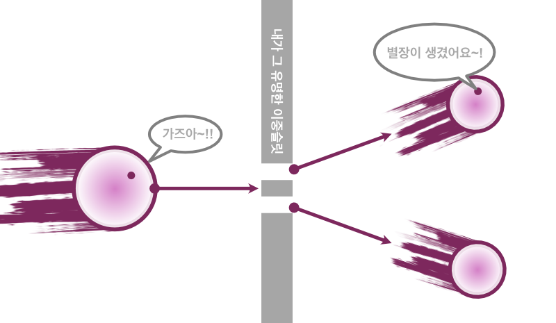

# 물질의 공간성과 시간성에 대한 가설
에테르-스파클 합성체로서의 물질과 에테르 독립적 스파클으로서의 광자

수진 sujin.2f@gmail.om

2022

## 1. 가설
본 가설은 하나의 의문에서 출발한다. 왜 누구도 입자의 확률 공간에 의미를 두지 않는가? 이 문서에서는 입자의 확률 공간을 입자의 일부로 보는 가설을 소개한다.

 

그림1-1. 가설

### 1-1. 질량 공간인 에테르와 광자 혹은 그에 준하는 스파클
전자의 이중슬릿 실험을 가설에 맞추어 재구성 해보자. 전자는 두 슬릿을 동시에 통과하며, 두 슬릿 중 한 곳에서만 관측된다. 전자가 공간이라는 가설을 적용하면 전자의 공간이 두 슬릿에 의해 분리가 되었다고 가정할 수 있다. 전자라는 공간은 우리가 공간이라 부르는 삼차원 좌표계에서 두 개로 나뉘었지만 관측 시점에서 입자는 한 곳에서만 나타난다. 이것은 전자의 공간이 두 개로 나뉘어질 수 있음과 동시에 해당 공간 속의 입자는 나뉘어지기 전과 똑같이 행동한다고 해석할 수 있다. 즉, 입자는 물리적으로 분리된 두 공간을 자유로이 넘나들지만 입자의 관점에서 봤을 때에는 여전히 한 공간에서 움직이고 있는 것이다. 그렇다면 전자의 공간은 우리가 아는 좌표계로서의 공간이 아닌 다른 무언가이다. 이를 에테르(ether)라 부르고, 우리가 입자라고 생각해왔던 것을 스파클(sparkle)이라 부르기로 하자. 확률 공간을 입자의 일부로 보는 가설은 이제 물질이 에테르와 스파클의 합성체라는 가설이 되었다.

 

그림1-2. 이중슬릿 실험의 가설 적용

그렇다면 에테르와 스파클은 각각 어떤 성질을 가지고 있을까? 광자와 전자의 비교를 통해 유추해 보고자 한다. 입자이자 파동인 두 물질은 비슷한 성질을 가지고 있지만 질량과 속력이라는 측면에서 다른 성질을 보인다. 에테르를 질량으로 생각하고 스파클을 광자, 혹은 그에 준하는 물질로 가정해 보자. 광자는 에테르(질량)를 가지지 않은 스파클이다. 광자의 공간은 우주 전체이고 그 속력은 관성계와 상관 없이 불변한다. 반면, 전자 속 스파클의 우주는 질량을 가진 에테르이다. 질량에 갖혀있는 스파클은 더 느린 속력을 가질 것이다. 광자가 다른 물질에 비해 불변의 속력을 가진 것은 독립적 스파클이 우주라는 공간 속에서 가지는 특서일 것이며, 전자 속의 스파클은 전자 에테르 속에서 역시 동일한 성질로 존재할 것이다.

에테르와 스파클의 또 다른 특징은 관측 가능성에 있다. 과학은 지금까지 스파클만을 관측했다. 에테르의 존재를 가정한다면, 에테르는 관측 불가능한 것이 된다.
 
### 1-2. 스파클 독립적 에테르 - 보어의 원자 모형에서
위에서 에테르-스파클 합성체로서의 물질과 에테르 독립적 스파클인 광자를 가정하였다. 그렇다면 광자의 반대 개념인 스파클 독립적 에테르가 존재할 수 있을지 의문을 가지게 된다. 앞선 가정에 의하여 에테르는 관측 불가능하다.

관측이 불가능한 스파클 독립적 에테르가 무엇인지 유추하기 위해 닐스 보어의 원자 모형을 살펴보도록 하겠다.

 

그림1-3. 보어의 원자 모형

특정 파장의 광자를 흡수한 전자는 그 궤도가 n이라는 정수만큼 증가하며, 해당 파장의 광자를 방출할 때 궤도는 감소한다. 여기서 에테르 독립적 스파클인 광자가 $E=m {c^{2}}$에 의하여 스파클 독립적 에테르로 변화하여 궤도 사이에 들어가는 것으로 생각의 틀을 바꿔보도록 하자.

 

그림1-4. 빛 에테르 가설

광자라는 스파클은 해당하는 에너지 만큼의 에테르-질량으로 전환되어 원자핵과 전자 사이에 위치하게 된다. 반대로 에너지를 방출할 때에는 에테르가 스파클로 전환되어 광자의 형태로 방출되는 것이라 가정해 보도록 하자.

## 2. 가설의 검증
### 2-1. 보어의 원자 모형에 기초한 방출 에너지

전자가 방출하는 파장은 뤼드베리 공식으로 구할 수 있다. 아래는 뤼드베리 공식과 $n \geqq 2$에서 $n=1$로 준위가 떨어질 때 방출되는 빛의 파장인 라이먼 계열과 $n \geqq 4$에서 $n=3$으로 변화하는 파센 계열의 방출 파장을 정리한 것이다.

$$\dfrac{1}{\lambda} = R(\dfrac{1}{1^2} - \dfrac{1}{n^2})$$

식2-1. 뤼드베리 공식 $(R=1.0974 \times 10^7 m^2)$

