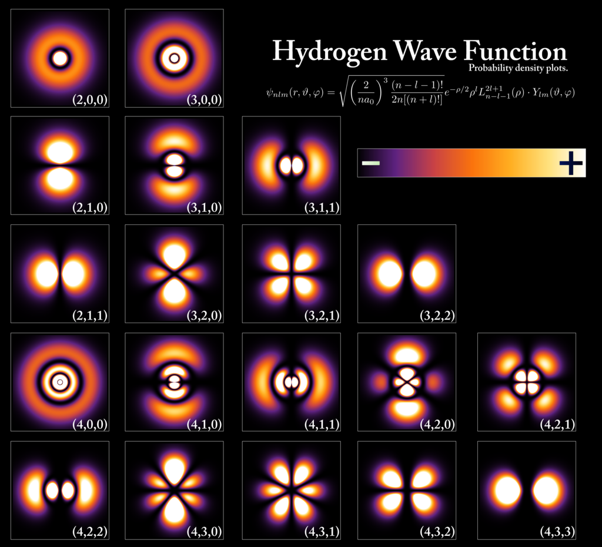
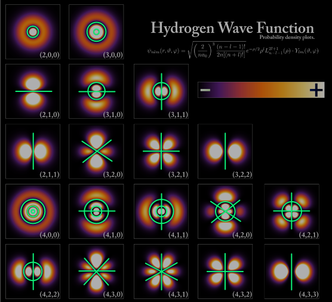
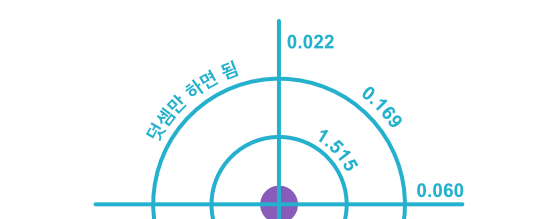

## 가설의 검증(2): 관측 데이터를 기준으로

지금까지는 보어의 원자모형을 기준으로 가설을 검증했었다. 그러나 보어 원자모형은 더 이상 유효하지 않다. 양자물리학이 밝혀낸 것은 원자에 속한 전자가 에너지를 흡수해서 오비탈이라는 형상으로 나타난다는 것이다.

 

전자 오비탈 [출처](https://en.wikipedia.org/wiki/Atomic_orbital)

오비탈의 모양은 앞서 보어 원자모형에서도 등장한 주양자수 n과 부양자수 l, 그리고 자기양자수인 m에 의해 결정된다. n의 증가는 보어 원자모형과 같이 원형의 자릿수를 증가시킨다. l의 증가는 원형 하나가 없어지면서 선형의 마디가 생겨난다. 자기양자수는 각도를 결정한다.

 

에테르의 관점으로 본 오비탈

이를 에테르의 관점으로 다시 보자. n의 증가는 에테르의 개수를 의미하며, l의 증가는 원형이었던 에테르를 선형으로 변화시킨다. s 오비탈은 원형의 에테르만을 가지고 있으며, p 오비탈은 선형 에테르 하나에 원형 에테르를 가진 것으로 해석할 수 있다. s1 오비탈은 에테르를 가지지 않은 상태이며, p3 오비탈은 원형 하나와 선형 하나를 가진 상태를 가지는 것이다.

이는 전자의 모양이 변화되는 것으로 이해되고 있으나, 에테르의 관점에서는 저 검은 마디가 에테르이며, 전자의 에테르는 구형 그대로를 유지하되 빛-에테르에 의해 공간이 분리된 것으로 이해할 수 있다. 마치 이중슬릿 실험에서 전자의 에테르가 분리가 된 것처럼 말이다. 그렇다면 전자-스파클은 전자-에테르의 형상에 맞추어 분리된 공간 속에서 확률적으로 존재한다고 할 수 있다.

에테르의 관점을 더 잘 나타내기 위해 원과 선으로 표기법을 정해보기로 하자. [-O]는 p3를, [--O]는 p4를 의미하게 될 것이다. [--OOOOO]와 같이 자릿수가 높아지면 가독성을 위해 [2-5O]와 같이 나타내는 방식을 병행하겠다. 아래 사용되는 데이터는 [NIST에서 참조](https://physics.nist.gov/PhysRefData/ASD/lines_form.html)하였다.

### 수소

수소는 보어 원자모형도 만족할 정도로 매우 규칙적인 값을 보인다. 여기서 수소를 굳이 언급하는 것은 NIST에서 제공되는 관측데이터의 정확성을 알아봄과 동시에 앞으로 다른 원자에서 어떤 것에 집중해야 하는지 환기하기 위함이다.

| digit | 2 | 3 | 4 | 5 | 6 |
|--|--|--|--|--|--|
| ether | O | OO | OOO | 4O | 5O |
| s | 0.749598748 | 0.888414493 | 0.936999893 | 0.959487940 | 0.971703647 |
| diff | 0.749598748 | 0.138815746 | 0.048585399 | 0.022488047 | 0.012215707
| %p | -0.05350032422 | -0.05266313712 | -0.05289250462 | -0.05312419686 | -0.05330589983 |
|-||||||
| ether | - | -O | -OO | -OOO | 1-4O |
| p | 0.749601760 | 0.888415385 | 0.937000269 | 0.959488132 | 0.971703758 | 
| diff | 0.749601760 | 0.138813625 | 0.048584884 | 0.022487863 | 0.012215626 |
| %p | -0.05309863513 | -0.05418985867 | -0.05395378685 | -0.05394014133 | -0.05397066086 |
|-||||||
| ether | - | -- | --O | --OO | --OOO |
| d | 0.749601760 | 0.888415713 | 0.937000407 | 0.959488203 | 0.971703799 | 
| diff |  | 0.138813953 | 0.048584694 | 0.022487795 | 0.012215597 |
| %p |  | -0.05395395350 | -0.05434343131 | -0.05424242279 | -0.05421013439 |
|-||||||
| ether |  | -- | --- | ---O | ---OO |
| f |  | 0.888415713 | 0.937000477 | 0.959488238 | 0.971703820 | 
| diff |  |  | 0.048584763 | 0.022487762 | 0.012215582 |
| %p |  |  | -0.05420088810 | -0.05439227154 | -0.05433297352 |

각 열에 해당하는 첫번째 값은 총 에너지의 EC 값이며, diff는 이전 값과의 차이를 의미하고, %p는 해당 위치에서의 Nth(n) 값을 100%로 보았을 때 어느 정도의 차이를 보이는지를 나타낸다. NIST의 데이터는 한 번의 관측이 아닌, 여러 번의 관측 결과를 모두 망라한 것이라 그만큼 엄밀하다고 볼 수 있다.

좌에서 우로의 값 변화를 주목해 봐야한다. 에테르가 늘어나는 것을 나타내기 때문이다. 이외에도 좌상단에서 우하단으로의 대각선 값 역시 주목해봐야 하는데, 이는 원형 에테르만을 보았을 때 같은 변화를 나타내기 때문이다. 예를 들어 p4는 [-O]에서 [-OO] 으로, 원형 에테르 하나에서 둘로 변화한 결과이며, 그 대각선에 위치한 d5는 [--O]에서 [--OO] 으로, 역시 원형 하나가 원형 둘이 되는 변화이기 때문이다. 좌하단의 빈 공간은 선형 에테르의 변화이기 때문에 [-]에서 [--]와 같은 변화를 의미한다. 이 역시 규칙적이어야 에테르 가설의 근거로 사용할 수 있다. 이 표의 좌우 방향과 대각선 방향, 그리고 선형의 변화를 모아놓은 시리즈가 일정한 규칙성을 가져야만 한다는 것을 강조하고 싶다.

다음 장인 헬륨부터는 diff는 생략하고 숫자의 자릿수는 더 짧게 만들어 가독성을 높일 것이다. 전체 데이터는 [이곳](https://docs.google.com/spreadsheets/d/1h2QDhSlGnuXcMU1NcTvEcK2VkTSHqCUGpOti0S6YP5c/edit?usp=sharing)에 정리하였다. 

### 다전자 원자

전자가 둘 이상인 다전자 원자의 EC는 수소형 원자와 같이 일정하지 않다. 과학자들은 이것이 다른 전자의 영향이라 이야기한다. 그럼에도 에테르 가설을 증명하기 위해서는 이것이 단순한 덧셈은 아니라도 일정한 경향을 가진다는 것을 보여야 한다. 비교적 다양한 오비탈을 볼 수 있는 헬륨의 데이터를 가져오도록 하자. 이것을 표로 정리하면 매우 실망스러운 결과를 볼 수 있다.

| digit | 2 | 3 | 4 | 5 | 6 | 7 | 8 | 9 | 10 |
|--|--|--|--|--|--|--|--|--|--|
| ether | O | OO | OOO | 4O | 6O | 7O | 8O | 9O | 10O |
| s (원형) | 1.515 | 1.685 | 1.740 | 1.765 | 1.778 | 1.786 | 1.791 | 1.794 | 1.797 |
| %p | 102.031 | 21.954 | 13.890 | 10.295 | 8.211 | 6.839 | 5.864 | 5.134 | 4.566 |
|-||||||||||
| ether | - | -- | --- | 4- | 5- | 6- | 7- | | |
| 선형 | 1.559 | 1.696 | 1.745 | 1.767 | 1.779 | 1.787 | 1.792 | | |
| %p | 107.933 | -1.780 | 0.234 | 0.026 | -0.004 | -0.011 | -0.013 | | |
|-||||||||||
| ether | - | -O | -OO | -OOO | 1-4O | 1-5O | 1-6O | 1-7O | 1-8O |
| p | 1.559 | 1.697 | 1.745 | 1.767 | 1.779 | 1.787 | 1.792 | 1.795 | 1.797 |
| %p | 107.933 | -1.095 | -0.958 | -0.783 | -0.655 | -0.562 | -0.491 | -0.437 | -0.393 |
|-||||||||||
| ether | - | -- | --O | --OO | --OOO | 2-4O | 2-5O | 2-6O | 2-7O |
| d | 1.559 | 1.696 | 1.745 | 1.767 | 1.779 | 1.787 | 1.792 | 1.795 | 1.797 |
| %p | | -1.780 | 0.132 | 0.111 | 0.093 | 0.079 | 0.067 | 0.059 | 0.051 |
|-||||||||||
| ether | | -- | --- | ---O | ---OO | ---OOO | 3-4O | 3-5O | 3-6O |
| f | | 1.696 | 1.745 | 1.767 | 1.779 | 1.787 | 1.792 | 1.795 | 1.797 |
| %p | |  | 0.234 | 0.006 | 0.005 | 0.003 | 0.002 | 0.000 | -0.001 |
|-||||||||||
| ether | | | --- | 4- | 4-1O | 4-2O | 4-3O | 4-4O | 4-5O |
| g | | | 1.745 | 1.767 | 1.779 | 1.787 | 1.792 | 1.795 | 1.797 |
| %p | | | | 0.026 | -0.010 | -0.010 | -0.010 | -0.010 | -0.010 |
|-||||||||||
| ether | | | | 4- | 5- | 5-1O | 5-2O | 5-3O | 5-4O |
| h | | | | 1.767 | 1.779 | 1.787 | 1.792 | 1.795 | 1.797 |
| %p | | | | | -0.004 | -0.013 | -0.012 | -0.013 | -0.013 |
|-||||||||||
| ether | | | | | 5- | 6- | 6-1O | 6-2O | 6-3O |
| i | | | | | 1.779 | 1.787 | 1.792 | 1.795 | 1.797 |
| %p | | | | | | -0.011 | -0.013 | -0.013 | -0.013 |
|-||||||||||
| ether | | | | | | 6- | 7- | 7-1O | 7-2O |
| k | | | | | | 1.787 | 1.792 | 1.795 | |
| %p | |  |  |  |  |  | -0.013 | -0.014 | |

s와 p 오비탈 그리고 선형 에테르에서 2번 위치는 100%p 정도로 높은 에너지를 보인다. 선형의 변화는 두 번째 자리에서 불규칙하다. d와 f 오비탈은 Nth(n) 보다 큰 값을 나타내며 나머지는 그보다 작은 값을 보인다. 자릿수가 증가할수록 Nth(n)에 일치하려는 경향을 보이기는 하나 대각선 성분은 들쭉날쭉 규칙성이 많이 망가지고 있다. 또한 선형 에테르 둘과 셋 위에 원형이 쌓이는 d와 f의 변화 경향이 왜 다른 경우와 다른지를 설명할 수 없기 때문에 위 표는 매우 불규칙한 것으로 해석할 수 있다. 경향성을 발견할 수가 없다. 망했다.

혹시 우리가 생각하는 틀이 문제인 것은 아닐까?

3p 오비탈을 보자. 저 값이 [-O]인 경우와 [O-]인 경우는 값이 달라야 옳다. 왜냐하면 원형과 선형은 분명 다른 방식으로 값에 영향을 미치고 있으며 그것이 자릿수에 의해서도 변화하기 때문이다. 107.933인 [-]가 [-O]로 된 것과 102.031인 [O]가 [O-]로 된 것은 첫 자리의 EC도 두 번째 자리의 EC도 다르다. 그런데 NIST에서 제공하는 3p의 값은 언제나 일정하다. 따라서 둘 중 하나만이 옳다고 봐야 한다.

우리가 오비탈을 이해할 때 s형, p형과 같이 이미 정의된 방식으로 선형 오비탈의 개수를 기준으로 분류를 받아들이게 된다. 만일 이것이 원형이 먼저 쌓이고 그 위에 선형이 쌓이는 것이라면 어떨까?

| digit | 2 | 3 | 4 | 5 | 6 | 7 | 8 | 9 | 10 |
|--|--|--|--|--|--|--|--|--|--|
| ether | O | OO | OOO | 4O | 6O | 7O | 8O | 9O | 10O |
| s (원형) | 1.515 | 1.685 | 1.740 | 1.765 | 1.778 | 1.786 | 1.791 | 1.794 | 1.797 |
| %p | 102.031 | 21.954 | 13.890 | 10.295 | 8.211 | 6.839 | 5.864 | 5.134 | 4.566 |
|-||||||||||
| ether | - | -- | --- | 4- | 5- | 6- | 7- | | |
| 선형 | 1.559 | 1.696 | 1.745 | 1.767 | 1.779 | 1.787 | 1.792 | | |
| %p | 107.933 | -1.780 | 0.234 | 0.026 | -0.004 | -0.011 | -0.013 | | |
|-||||||||||
| ether | O | O- | O-- | O--- | 1O4- | 1O5- | 1O6- | 1O7- | |
| 1S Base | 1.515 | 1.697 | 1.745 | 1.767 | 1.779 | 1.787 | 1.792 | 1.795 | |
| %p | | 30.776 | -1.825 | 0.226 | 0.027 | -0.004 | -0.011 | -0.013 | |
|-||||||||||
| ether | | OO | OO- | OO-- | OO--- | 2O4- | 2O5- | 2O6- | 2O7- |
| 2S Base | | 1.685 | 1.745 | 1.767 | 1.779 | 1.787 | 1.792 | 1.795 | |
| %p | | | 24.247 | -1.762 | 0.217 | 0.027 | -0.004 | -0.011 | |
|-||||||||||
| ether | | | OOO | OOO- | OOO-- | OOO--- | 3O4- | 3O5- | 3O6- |
| 3S Base | | | 1.740 | 1.767 | 1.779 | 1.787 | 1.792 | 1.795 | 1.797 |
| %p | | | | 21.593 | -1.709 | 0.209 | 0.026 | -0.004 | -0.011 |
|-||||||||||
| ether | |  |  | 4O | 4O1- | 4O2- | 4O3- | 4O4- | 4O5- |
| 4S Base | | | | 1.765 | 1.779 | 1.787 | 1.792 | 1.795 | 1.797 |
| %p | | | | | 20.143 | -1.670 | 0.202 | 0.026 | -0.004 |
|-||||||||||
| ether | | | | | 5O | 5O1- | 5O2- | 5O3- | 5O4- |
| 5S Base | | | | | 1.778 | 1.787 | 1.792 | 1.795 | 1.797 |
| %p | | | | | | 19.228 | -1.639 | 0.197 | 0.025 |
|-||||||||||
| ether | | | | | | 6O | 6O1- | 6O2- | 6O3- |
| 6S Base | | | | | | 1.786 | 1.792 | 1.795 | 1.797 |
| %p | | | | | | | 18.597 | -1.616 | 0.193 |
|-||||||||||
| ether | | | | | | | 7O | 7O1- | 7O2- |
| 7S Base | | | | | | | 1.791 | 1.795 | 1.797 |
| %p | | | | | | | | 18.136 | -1.597 |
|-||||||||||
| ether | | | | | | | | 8O | 8O1- |
| 8S Base | | | | | | | | 1.794 | 1.797 |
| %p | | | | | | | | | 17.784 |

보이는가 휴먼? 이 아름다운 경향성이? 먼저 선형 에테르의 변화를 보자. 첫 번째 자리는 +107%p 정도의 높은 값이다. 두 번째는 -1.78 정도로 떨어지며, 세 번째와 네 번째는 0.23, 0.03 정도의 양수였다가 다시 음수가 된다. 혹은 세 번째 부터 점점 감소한다고 보아도 된다. 이것은 모든 줄에서 동일하게 나타난다.

신이 좀 났으니 아직 안 보이는 휴먼들을 위해 대각선 방향을 정리한 표를 그려 보겠다.

| digit | 2 | 3 | 4 | 5 | 6 | 7 | 8 | 9 | 10 |
|--|--|--|--|--|--|--|--|--|--|
| 첫번째 선형 %p | 107.933 | 30.776 | 24.247 | 21.593 | 20.143 | 19.228 | 18.597 | 18.136 | 17.784 |
| 두번째 선형 %p | | -1.780 | -1.825 | -1.762 | -1.709 | -1.670 | -1.639 | -1.616 | -1.597 |
| 세번째 선형 %p | | | 0.234 | 0.226 | 0.217 | 0.209 | 0.202 | 0.197 | 0.193 |
| 네번째 선형 %p | | | | 0.026 | 0.027 | 0.027 | 0.026 | 0.026 | 0.025 |
| 다섯번째 선형 %p | | | | | -0.004 | -0.004 | -0.004 | -0.004 | -0.004 |
| 여섯번째 선형 %p | | | | | | -0.011 | -0.011 | -0.011 | -0.011 |
| 일곱번째 선형 %p | | | | | | | -0.013 | -0.013 | |

선형 에테르가 첫 번째 자리에 위치할 때는 높은 값의 EC를, 그리고 두 번째는 마이너스 값을, 세 번째부터는 Nth(n)로 수렴하는 경향을 보인다고 말할 수 있다. 선형 에테르가 쌓이는 방식을 설명할 수 있게 된 것이다. 즉, 전자의 모양이 변한 것이 오비탈이 아니라, 그 마디인 빛-에테르가 에너지를 가지고 있는 것이며, 오비탈은 빛-에테르에 의해 나누어진 원형의 전자-에테르인 것이다. 더 보기 좋은 데이터는 [이곳](https://docs.google.com/spreadsheets/d/1h2QDhSlGnuXcMU1NcTvEcK2VkTSHqCUGpOti0S6YP5c/edit?usp=sharing)을 방문하면 볼 수 있다.

 

헬륨의 에테르 [OO--]

데이터가 약간 부족하기는 하나, 이는 리튬, 베릴륨, 붕소, 네온 등과 같은 다른 원소에서도 관찰할 수 있다. 이는 원형과 선형의 에테르가 쌓이는 방식이 존재하며 그에 맞추어 EC가 증가하는 것으로 해석할 수 있다. 노력을 더 기울이면 완벽한 예측이 가능한, 아름다운 수식으로 정리할 수 있을 것도 같지만 이는 다음 과제로 삼기로 하자.

---

- 목차: [목차](./README.md)
- 이전 문서: [가설의 검증(1): 에너지](./energy.md)
- 다음 문서: [가설의 검증(3): 슈뢰딩거 방정식](./schrodinger_equation.md)
