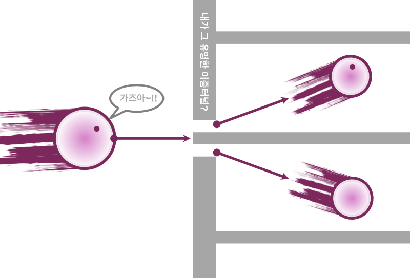
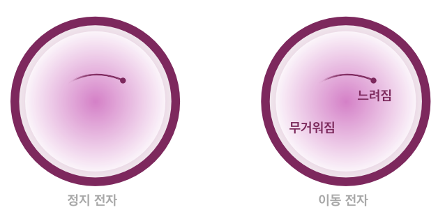
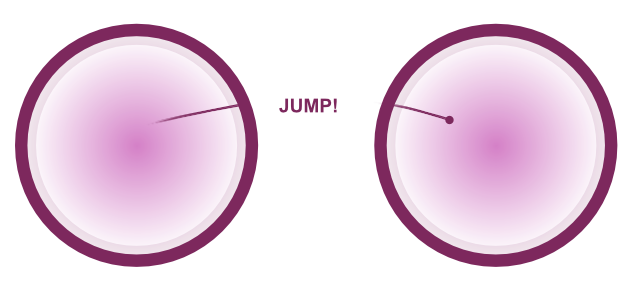

## 결론
본 문서는 매우 과격한 주장을 담고 있으며 그 가설이 옳을 수도 있다는 아주 작은 가능성을 열어준다.

가설이 옳다는 가정하에, 우리가 아는 입자는 기존의 모델과 완전히 다른 것이 된다. 질량은 우리가 확률 공간으로 알고 있었던 질량 공간이 되며 관측할 수 없는 것이 된다. 우리가 아는 광자는 에테르 속 스파클과 동일한 존재가 된다. 그리고 원자에 흡수된 에너지는 질량의 형태로 보존될 것이다. 계산해보면 전자보다도 훨씬 적은 량이라 실험할 수 있을지는 모르겠다.

그렇다면 광자-에테르, 다시 말해 스파클이 없는 에테르는 무엇일까? 관측이 불가능하고 질량을 가지는 물질. 현대 물리학에서 생각할 수 있는 가능성은 암흑물질이다. 물론 관측이 매우 힘든 중성미자일 가능성도 있으며, 둘 다 아닐 수도 있겠다.

### 실험 제안

 

<strong>이중 터널 실험</strong>: 둘로 쪼개면 어디에 있을까?

질량을 측정하는 것 이외에도 가설을 증명하는 실험도 설계할 수 있다. 이중 슬릿이 아닌 이중 터널을 만드는 것이다. 이중 슬릿을 길게 만들어 터널과 같이 만들어 주고 그 안에 전자를 가두면 무슨 일이 일어날까? 터널 A와 B에는 나누어진 에테르가 각각 위치할 것이고 스파클은 두 개의 에테르를 오갈 것이다. 이를 관찰하면 각 터널에서 전자는 확률적으로 존재하며 동시에 관측할 경우 단 하나의 터널에서만 나타날 것이다. 한쪽의 에테르가 사라지면서 공간을 넘어 다른 쪽 에테르로 흡수될 수도 있다. 그렇지 않다면 우주는 쪼개진 에테르로 넘쳐날 것이기 때문에 안정적일 수 없다.

**Added on 2022-11-15** 그런데 정말로 그 일이 일어났습니다. 실험을 한 것이다. 실험에서는 중성자 하나를 두 통로로 통과시켜 각각 스핀을 변화시키는 방식으로 행해졌다. 그러자 스핀의 변화가 양쪽 모두의 영향을 받은 것. [Quantifying the presence of a neutron in the paths of an interferometer](https://journals.aps.org/prresearch/abstract/10.1103/PhysRevResearch.4.023075)

### 가설의 가설 (1): 시간은 스파클의 속성?

스파클이란 무엇일까? 에테르는 빛의 속도를 넘을 수 없다. 질량이 증가하기 때문이다. 빛의 속도에 가까워질수록 에테르 질량은 최대치가 되며 그 속의 스파클은 결국 멈추게 될 것이다. 따라서 빛이라는 스파클이 광속으로 움직일 수 있는 것이다. 에테르가 없기 때문이다. 바꾸어 말하면 스파클은 시간이라는 속성을 가지고 있다고 생각할 수 있다. 따라서 시간은 우주의 속성이 아닌, 물질의 '속성'이 된다. 잘 생각해 보면 우주가 시간을 가져야할 당위는 없다.

 

<strong>에테르-스파클 관점으로 본 시간지연</strong> 시간은 물질이 가진 속성으로 속력이 변할 수 있다

이를 적용하면 시간지연을 더 깔끔하게 설명할 수 있게 된다. 다른 관성계에서, 다른 중력에서는 스파클의 속력이 달라지어 시간이 변하는 것이다. 우리 우주에 시간이 존재하는 것이 아니라 각각의 물질이 시간을 가진 것이 된다. 우리를 구성하는 수많은 물질들의 시간 역시 다르게 흐를 것이다. 양성자와 전자의 중량 차이만큼 시간은 같은 물리계 안에서도 다르게 흐를 것이다. 그리고 이것이 양자 시계가 정확한 이유가 될 것이다. 물질이 시간을 가지고 있기 때문이다.

### 가설의 가설 (2): 양자 얽힘은 분리된 에테르?

 

<strong>에테르-스파클 관점으로 본 양자 얽힘</strong> 스파클은 두 에테르가 하나인 것 처럼 행동한다

가설에 따라 전자-에테르가 광자-에테르에 의해 나누어지는 것을 보였다. 이중 슬릿 실험에서도 전자 에테르는 두 개로 나뉘게 된다. 그 나누어진 에테르 속 스파클은 양쪽의 에테르를 자유로이 오간다. 하나의 에테르는 우리가 인지하는 좌표 공간에서 분리가 되더라도 같은 에테르로 기능한다. 양자 얽힘은 이러한 에테르의 성질에서 오는 것이 아닐까 조심스레 의견을 제시하고자 한다.

### 향후 과제

다전자 원자에서도 EC는 일정한 규칙을 따르는 듯이 보인다. 이를 잘 탐구하면 방정식을 만드는 것이 가능할 것이다. Z번 원자에서 n 자리의 선형 에테르와 원형 에테르의 EC를 구하는 방정식을 만들어서 더한다면 원자가 흡수/방출할 수 있는 정확한 에너지를 구할 수 있게 될 것이다. 이는 해당 에테르의 에너지를 정확히 알아낼 수 있다는 뜻이다.

[끝]

---

- 목차: [목차](./README.md)
- 이전 문서: [가설의 검증(3): 슈뢰딩거 방정식](./schrodinger_equation.md)
