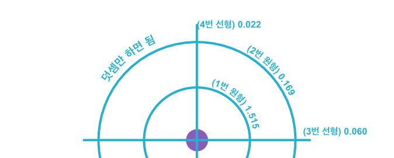

## 가설의 검증(2): 다 전자 원자

지금까지는 보어의 원자모형을 기준으로 가설을 검증했었다. 그러나 보어 원자모형은 더 이상 유효하지 않다. 양자물리학이 밝혀낸 것은 원자에 속한 전자가 에너지를 흡수해서 오비탈이라는 형상으로 나타난다는 것이다. 이제 더 이상 에테르는 원형이 아니다.

 

<strong>전자 오비탈</strong> <a href="https://en.wikipedia.org/wiki/Atomic_orbital">출처: 위키피디아</a>

오비탈의 모양은 앞서 보어 원자모형에서도 등장한 주양자수 n과 부양자수 l, 그리고 자기양자수인 ml에 의해 결정된다. n의 증가는 보어 원자모형과 같이 원형의 자릿수를 증가시킨다. l의 증가는 원형 하나가 없어지면서 선형의 마디가 생겨난다. 자기양자수는 각도를 결정한다.

원형의 마디를 가진 오비탈을 s 오비탈이라고 부른다. 마디가 없으면 s1, 원형 마디가 하나일 때 s2이다. 선형의 마디를 하나 가진 오비탈을 p라고 한다. 선형 하나면 p2, 선형 하나에 원형 하나면 p3이다. 이런 식으로 선형의 마디 개수를 기준으로 d, f, g와 같은 이름을 가진다.

 

<strong>에테르의 관점으로 본 오비탈</strong> 원형과 선형 에테르가 혼합되어 있는 형태

이를 에테르의 관점으로 다시 보자. n의 증가는 에테르의 개수를 의미하며, l의 증가는 원형이었던 에테르를 선형으로 변화시킨다. s 오비탈은 원형의 에테르만을 가지고 있으며, p 오비탈은 선형 에테르 하나에 원형 에테르를 가진 것으로 해석할 수 있다. s1 오비탈은 에테르를 가지지 않은 상태이며, p3 오비탈은 원형 하나와 선형 하나를 가진 상태를 가지는 것이다.

이는 전자의 모양이 변화되는 것으로 이해되고 있으나, 에테르의 관점에서는 저 검은 마디가 에테르이며, 전자의 에테르는 구형 그대로를 유지하되 광자-에테르에 의해 공간이 분리된 것으로 이해할 수 있다. 마치 이중슬릿 실험에서 전자의 에테르가 분리가 된 것처럼 말이다. 그렇다면 전자-스파클은 전자-에테르의 형상에 맞추어 분리된 공간 속에서 확률적으로 존재한다고 할 수 있다. 그렇게 나타난 형상이 바로 오비탈인 것이다.

에테르의 관점을 더 잘 나타내기 위해 원과 선으로 표기법을 정해보기로 하자. [-O]는 p3를, [--O]는 d4를 의미하게 될 것이다. [--OOOOO]와 같이 자릿수가 높아지면 가독성을 위해 [2-5O]와 같이 나타내는 방식을 병행하겠다. 아래 사용되는 데이터는 [NIST에서 참조](https://physics.nist.gov/PhysRefData/ASD/lines_form.html)하였다. Configuration은 l값만이 변하는 세트들로 가져왔다. (1S/J=0, 1P/J=1, 1D/J=2...) 모든 데이터는 [이렇게](https://ether.sujinc.com/orbital/1+1/graph/percent) 표와 그래프로 시각화 하였다. 표에서 Correction은 아래의 수식을 만족시키는 보정 값이다.

$$Diff = (\frac{1}{n+c})^2 - (\frac{1}{n+1+c})^2$$

### 수소: 전자 하나

수소는 보어 원자모형도 만족할 정도로 매우 규칙적인 값을 보인다. 여기서 수소를 굳이 언급하는 것은 NIST에서 제공되는 관측데이터의 정확성을 알아봄과 동시에 앞으로 다른 원자에서 어떤 것에 집중해야 하는지 환기하기 위함이다.

https://ether.sujinc.com/orbital/1+1/graph/percent

<strong>수소원자</strong> 고전 물리학으로도 설명할 수 있는 단순함

NIST의 데이터는 한 번의 관측이 아닌, 여러 번의 관측 결과를 모두 망라한 것이라 그만큼 엄밀하다고 볼 수 있다. 주지하다시피, 수소 원자의 스펙트럼과 Nth(n)의 오차는 거의 없다시피 하다. 그러나 그 얼마 안되는 오차에도 경향성을 볼 수 있다. 이것은 나중에 설명하는 것으로 하자.

눈 여겨봐야 하는 값은 첫째, **s 오비탈**이다. **원형 에테르가 하나씩 증가**하는 부분이기 때문이다. **p 오비탈을 시작으로 좌상단에서 우하단으로의 대각선** 값 역시 주목해봐야 하는데, 첫번째 대각선 값은 **선형 에테르가 하나씩 증가**하는 부분이다. 두번째 부터는 **원형 에테르만을 보았을 때 같은 변화**를 나타내기 때문이다. 예를 들어 p4는 [-O]에서 [-OO] 으로, 원형 에테르 하나에서 둘로 변화한 결과이며, 그 대각선에 위치한 d5는 [--O]에서 [--OO] 으로, 역시 원형 하나가 원형 둘이 되는 변화이기 때문이다. 이는 같은 개념인 s 오비탈을 포함해서 일정한 규칙을 지녀야 한다. 즉, **s 오비탈과 대각선 변화는 같은 경향성을 가져야 한다**는 것이다.

다시 그래프를 보자. 원형 에테르의 증가인 s 오비탈(붉은색)은 올라갔다 내려오는 형태를 보인다. 선형 에테르는 좌상단에서 우하단으로의 곡선 형태인 y=a/x와 같은 모습을 보인다. p 오비탈 부터는 내려갔다 올라갔다 다시 내려가는 형태를 보인다. 위에서 내가 강조한 '경향성'이란 s 오비탈의 원형 에테르의 증가와 p 오비탈의 원형 에테르 증가가 비슷한 형상을 보여야 한다는 것이다. 그래프가 예쁘기는 하지만 딱 드러맞지는 않는다.

### 헬륨: 다전자 원자 (2개)

전자가 둘 이상인 다전자 원자의 Rydberg는 수소형 원자와 같이 일정하지 않다. 과학자들은 이것이 다른 전자의 영향이라 이야기한다. 그럼에도 에테르-스파클 가설을 증명하기 위해서는 이것이 단순한 덧셈은 아니라도 일정한 경향을 가진다는 것을 보여야 한다. 비교적 다양한 오비탈을 볼 수 있는 헬륨의 데이터를 가져오도록 하자. 이것을 표로 정리하면 **매우 실망스러운 결과**를 볼 수 있다.

https://ether.sujinc.com/orbital/2+1/graph/percent

<strong>헬륨 원자</strong> 예상과는 너무 다르다 / 폭망

s와 p 오비탈 그리고 선형 에테르에서 2번 위치는 100%p 정도로 높은 에너지를 보인다. d와 f 오비탈은 Nth(n) 보다 큰 값을 나타내며 나머지는 그보다 작은 값을 보인다. 자릿수가 증가할수록 Nth(n)에 일치하려는 경향을 보이기는 하나 대각선 성분은 들쭉날쭉 규칙성이 많이 망가지고 있다. 무엇보다 s 오비탈과 다른 오비탈들은 똑같이 원형의 변화를 나타냄에도 다른 경향성을 보인다. 또한 선형 에테르 둘과 셋 위에 원형이 쌓이는 d와 f의 변화 경향이 왜 다른 경우와 다른지를 설명할 수 없기 때문에 위 표는 매우 불규칙한 것으로 해석할 수 있다. 경향성을 발견할 수가 없다. 끝.

혹시 우리가 생각하는 틀이 문제인 것은 아닐까?

3p 오비탈을 보자. 저 값이 [-O]인 경우와 [O-]인 경우는 값이 달라야 옳다. 왜냐하면 원형과 선형은 분명 다른 방식으로 값에 영향을 미치고 있으며 그것이 자릿수에 의해서도 변화하기 때문이다. 107.933인 [-]가 [-O]로 된 것과 102.031인 [O]가 [O-]로 된 것은 첫 자리의 Rydberg도 두 번째 자리의 Rydberg도 다르다. 그런데 NIST에서 제공하는 3p의 값은 언제나 일정하다. 따라서 둘 중 하나만이 옳다고 봐야 한다.

우리가 오비탈을 이해할 때 s형, p형과 같이 이미 정의된 방식으로 선형 오비탈의 개수를 기준으로 분류를 받아들이게 된다. 만일 이것이 원형이 먼저 쌓이고 그 위에 선형이 쌓이는 것이라면 어떨까?

https://ether.sujinc.com/ether/2+1/graph/percent

<strong>원형이 먼저다!!</strong>

보이는가 휴먼? 이 아름다운 경향성이? 각 행은 원형 위에 선형이 증가하는 것을 나타낸다. 그러니 이번에는 원형 오비탈을 제외한 다른 그래프들의 경향성이 보여야 한다. 떨어졌다 올라오면서 Nth(n)에 수렴하는 모습을 보인다.

신이 좀 났으니 아직 안 보이는 휴먼들을 위해 대각선 방향을 정리한 표를 그려 보겠다.

| digit            | 2       | 3      | 4      | 5      | 6      | 7      | 8      | 9      | 10     |
| ---------------- | ------- | ------ | ------ | ------ | ------ | ------ | ------ | ------ | ------ |
| 첫번째 선형 %p   | 107.933 | 30.776 | 24.247 | 21.593 | 20.143 | 19.228 | 18.597 | 18.136 | 17.784 |
| 두번째 선형 %p   |         | -1.780 | -1.825 | -1.762 | -1.709 | -1.670 | -1.639 | -1.616 | -1.597 |
| 세번째 선형 %p   |         |        | 0.234  | 0.226  | 0.217  | 0.209  | 0.202  | 0.197  | 0.193  |
| 네번째 선형 %p   |         |        |        | 0.026  | 0.027  | 0.027  | 0.026  | 0.026  | 0.025  |
| 다섯번째 선형 %p |         |        |        |        | -0.004 | -0.004 | -0.004 | -0.004 | -0.004 |
| 여섯번째 선형 %p |         |        |        |        |        | -0.011 | -0.011 | -0.011 | -0.011 |
| 일곱번째 선형 %p |         |        |        |        |        |        | -0.013 | -0.013 |        |

선형 에테르가 첫 번째 자리에 위치할 때는 높은 값의 Rydberg를, 그리고 두 번째는 마이너스 값을, 세 번째부터는 Nth(n)로 수렴하는 경향을 보인다고 말할 수 있다. 함수를 만들어 예측 가능한 값이 된 것이다. 이 값들을 단순히 더하는 것으로 Rydberg를 예측할 수도 있을 것이다.

다시 말해, 앞서 제시한 에테르의 존재 조건을 만족했다고 볼 수 있다. 규칙이 존재한다.

선형 에테르가 쌓이는 방식을 설명할 수 있게 된 것이다. 즉, 전자의 모양이 변한 것이 오비탈이 아니라, 그 마디인 광자-에테르가 에너지를 가지고 있는 것이며, 오비탈은 광자-에테르에 의해 나누어진 원형의 전자-에테르라는 가설에 한 걸음 다가갔다.

위 표는 퍼센트 포인트를 표시한 것이다. 덧셈을 위한 각 자리수의 값은 아래와 같다. 아래의 값은 위 표에서 생략한 diff 값으로, 자리수에 맞게 넣어주면 정확한 Rydberg를 알 수 있다. digit에 쓰였던 숫자는 오비탈을 기준으로 2번 부터 시작한 것이다. 이제 자리수라는 의미로 1번 부터 시작한다.

| digit         | 1     | 2     | 3     | 4     | 5     | 6     | 7     | 8     | 9     |
| ------------- | ----- | ----- | ----- | ----- | ----- | ----- | ----- | ----- | ----- |
| 원형 에테르   | 1.515 | 0.169 | 0.055 | 0.025 | 0.013 | 0.008 | 0.005 | 0.003 | 0.002 |
| 첫번째 선형   | 1.559 | 0.182 | 0.060 | 0.027 | 0.015 | 0.009 | 0.006 | 0.004 | 0.003 |
| 두번째 선형   |       | 0.136 | 0.048 | 0.022 | 0.012 | 0.007 | 0.005 | 0.003 | 0.002 |
| 세번째 선형   |       |       | 0.049 | 0.023 | 0.012 | 0.007 | 0.005 | 0.003 | 0.002 |
| 네번째 선형   |       |       |       | 0.023 | 0.012 | 0.007 | 0.005 | 0.003 | 0.002 |
| 다섯번째 선형 |       |       |       |       | 0.012 | 0.007 | 0.005 | 0.003 | 0.002 |
| 여섯번째 선형 |       |       |       |       |       | 0.007 | 0.005 | 0.003 | 0.002 |
| 일곱번째 선형 |       |       |       |       |       |       | 0.005 | 0.003 |       |

 

<strong>헬륨의 에테르 [OO--]</strong> 각 자리수에 있는 값은 예측 가능해 보이고 그것들을 더하거나 빼는 것으로 총 Rydberg를 계산할 수 있다. 실제로 쓰여진 값은 원형 1번을 시작으로 →→↘︎↘︎로 내려가면 된다.

데이터가 약간 부족하기는 하나, 이는 리튬, 베릴륨, 붕소, 네온 등과 같은 다른 원소에서도 관찰할 수 있다. 역시 같은 사이트에서 값을 바꿈으로 확인 가능하다. 예를 들자면 [네온](https://ether.sujinc.com/ether/10+1/graph/percent)과 같이 말이다. 노력을 더 기울이면 완벽한 예측이 가능한, 아름다운 수식으로 정리할 수 있을 것도 같지만 이는 다음 과제로 삼기로 하자.

---

-   목차: [목차](./intro.md)
-   이전 문서: [가설의 검증(1): 고전 물리학](./energy.md)
-   다음 문서: [가설의 검증(3): 슈뢰딩거 방정식](./schrodinger_equation.md)
