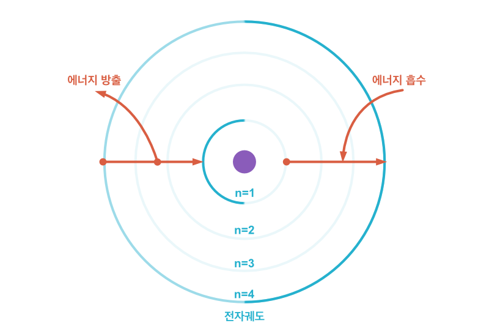
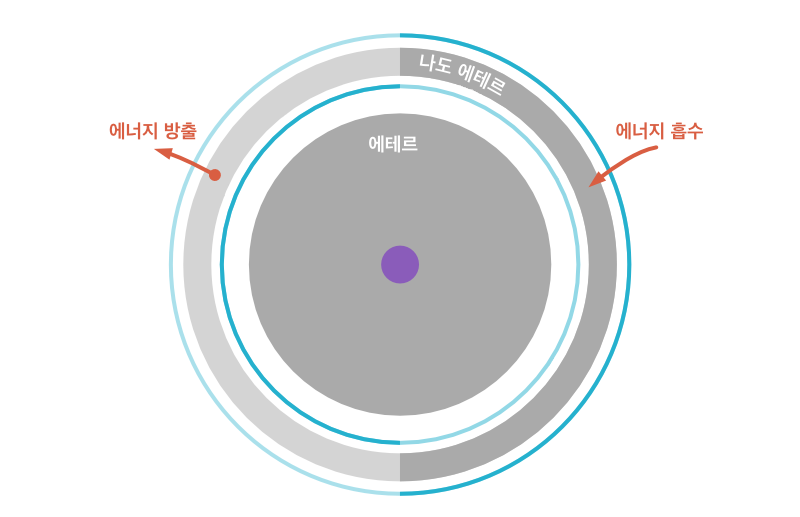

## Hypothesis

Every hypothesis starts with a question. A particle exists in probability, yet nobody applies further more meaning to it. What if the probability space is a part of the particle?

 

<strong>Hypothesis</strong> The probability cloud would be a part of the particle

### Double-Slit Experiment

Let me reconstruct the [double-slit experiment](https://en.wikipedia.org/wiki/Double-slit_experiment) of an electron along with the hypothesis. This famous experiment shows the wave-particle duality well. The electron passes two slits at the same time, but it appears at one slit by the observation. After all, it produces a wave pattern.

 

<strong>Applying the hypothesis to the double-slit experiment</strong> The space can be divided

With my hypothesis, the probability cloud is a part of an electron. We can assume the space of an electron is separated by the double-slit. Now, the space of an electron becomes two spaces, but the particle can go around through the spaces. The wave pattern means both spaces have a particle.

If so, the space of an electron is not the same as the space we know. It is a new space that can be divided but also connected to each other. I name this space `ether`, and what we have thought as a particle is a `sparkle`. Now, the hypothesis becomes the hypothesis that the matter is a compound of ether and a sparkle.

 

<strong>Name it!</strong>: ether and a sparkle

So, what are the nature of ether and a sparkle? Let me analogize with a photon and an electron. The two matters have similar characteristics -- both a particle and wave, but they are different in mass and speed. The weight of the photon is zero, and it has the speed of light in a vacuum. In contrast, the electron has weight and does not move like the photon.

The hypothesis explains that the electron has a space, and the sparkle is bonded to the space. Therefore, I guess the photon is a standalone sparkle that does not have any ether. Following this idea, I can assume the ether has a mass, and the sparkle is a photon or similar material. The space of a photon-sparkle is a universe, and its speed is consistent. Yet, the universe of the electron-sparkle is electron-ether, so the sparkle is bonded to the mass. Thus, it has a lower speed. The nature of the photon and electron is from the space of each sparkle.

 

<strong>The differences between the sparkle and electron</strong>

Another difference between the ether and a sparkle would be observability. Science has observed the sparkle only. Assuming the existence of the ether, the ether has a mass but does not have observability.

### Standalone Ether, The Photon-Ether: from the Bohr model

I have assumed the matter is the ether-sparkle compound and the photon is a standalone sparkle. It is natural to have a question about the existence of standalone ether: the thing which is not observable and has a mass.

Let me reanalyze the Bohr model to guess what it is.

 

<strong>Classic Physics</strong>: Bohr Model

According to the Bohr model, an atom absorbs a certain amount of energy with an increment in its orbit by integer n, and releasing energy acts the opposite way. What if I changed this model to a mass goes in between the orbits? Let me reconstruct this model to the standalone sparkle turns into the standalone ether and goes between the orbit.

 

<strong>Reconstruction Bohr Model by Ether-Sparkle Hypothesis</strong>

A photon-sparkle morphs into the photon-ether along with its energy and is placed into the orbit, so the position of the electron would be increased. On the other hand, when the ether turns into a sparkle, the position of the electron decreased. When the atom absorbs the photon, the photon becomes a mass and is placed into the electron cloud.

In the next chapter, I explore the nature of photon-ether to prove my hypothesis. It would be a small proof if the photon-ether has a certain characteristic.

---

-   Prev Chapter: [Introduction](../README.md)
-   Next Chapter: [Proof(1): Classic Physics](./energy_en.md)
