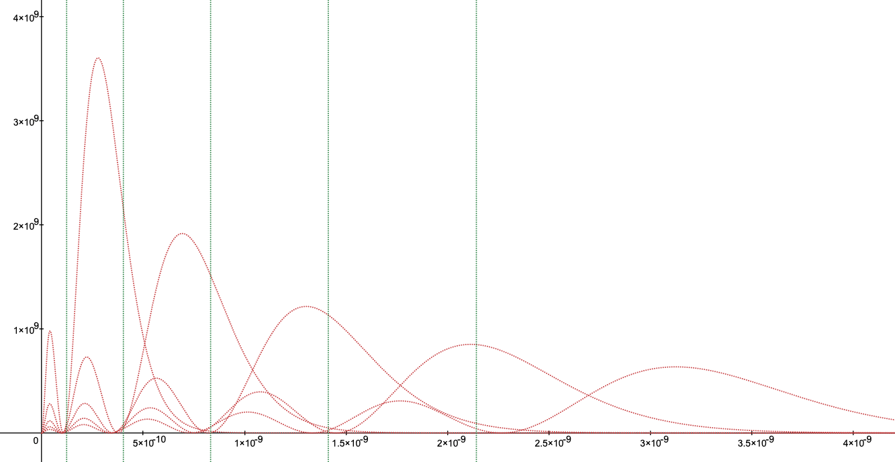
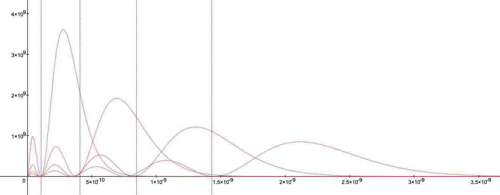

## Proof(3): Schrodinger Equation

Caution: This chapter is not perfectly mathematical. The formula is somewhat manipulated. So, you can pass it to [the next chapter](./conclusion_en.md).

### The Photon-Ether from Schrodinger Equation

As we observed in the previous chapter, an ether creates orbital. Therefore, is it possible to make photon-ether equation to manipulate the hydrogen Schrodinger equation? The position of nodes can get with the R(r) equation, which is the radial equation.

$$\frac{1}{R(r)} \frac{d}{dr} (r^2 \frac{d}{dr}) R(r) - \frac{2 \mu r^2}{ℏ^2}(V(r)-E) - l(l+1) = 0$$

$$\to \frac{d}{dr} (r^2 \frac{d}{dr}) R(r) + [\frac{2 \mu r^2}{ℏ^2}E - \frac{2 \mu r^2}{ℏ^2}V(r) - l(l+1)]R(r) = 0$$

The Radial Equation, R(r)

I will use the way to make the form of associated Laguerre polynomials and functions.

$$y_j^k(x) = e^{-x/2} x^{(k+1)/2} L_j^k(x)$$

$${y_j^k}''(x) + (-\frac{1}{4} + \frac{2j+k+1}{2x} - \frac{k^2-1}{4x^2})y_j^k(x) = 0$$

Slightly Different Associated Laguerre Equation and its Solution

First, let me substitute y(r) = rR(r).

$$r\frac{d^2y(r)}{dr^2} + [\frac{2 \mu r^2}{ℏ^2}E - \frac{2 \mu r^2}{ℏ^2}V(r) - l(l+1)]\frac{y(r)}{r} = 0$$

$$\to \frac{d^2y(r)}{dr^2} + [\frac{2 \mu}{ℏ^2}E - \frac{2 \mu}{ℏ^2}V(r) - \frac{l(l+1)}{r^2}]y(r) = 0$$

And then, apply other substitutions.

$$(\frac{\epsilon}{2})^2 = -\frac{2\mu}{ℏ^2}E \hspace{10pt} , \hspace{10pt} x=r\epsilon$$

$$\epsilon^2\frac{d^2y(x)}{dx^2} + [-\frac{\epsilon^2}{4} + \frac{2 \mu}{ℏ^2}V(r) - \epsilon^2\frac{l(l+1)}{x^2}]y(x) = 0$$

$$\to \frac{d^2y(x)}{dx^2} + [-\frac{1}{4} + \frac{2 \mu}{ℏ^2\epsilon^2}V(r) - \frac{l(l+1)}{x^2}]y(x) = 0$$

This form is identical with the associated Laguerre equation above. First, using the third group in the bracket is same with k2 - 1 group in the associated Laguerre equation, we can get the relationship between l and k, l \* (l + 1) = (k2 - 1) / 4 => k = 2l + 1. Also, the group includes V(r) is same with (2j + k + 1) / 2x, so I will get what is E. We can say (2j + k + 1) / 2 is j + l + 1, and this converted to n in hydrogen atom. However, our photon-ether starts from 2, so I will set this as n - 1.

$$\frac{2 \mu}{ℏ^2\epsilon^2}V(r) = \frac{2j+k+1}{2x}$$

$$\to \frac{2 \mu}{ℏ^2\epsilon^2}V(r) = \frac{n-1}{x}$$

Let me change ɛ2 with the substitution rule above,

$$-\frac{2 \mu}{ℏ^2} \frac{ℏ^2}{4\mu} \frac{V(r)}{E} = \frac{n-1}{x}$$

$$\to-\frac{1}{2} \frac{V(r)}{E} = \frac{n-1}{x}$$

Let me convert this to the relationship with E and n.

$$E = -\frac{1}{n-1} \frac{x}{2}V(r)$$

We already know the energy, Eth(n). However, we don't know about V(r). I know this is not logical enough, but let me assume x / 2 \* V(r) to Eth(n) \_ 1 / ɑ.

$$\to E = -\frac{1}{n-1} E_{th}(n) \frac{1}{\alpha} $$

$$\to E\alpha = -\frac{ℏ^2}{2 \mu a_0 ^ 2} N_{th}(n) \frac{1}{n-1}$$

Getting `x` from substitution of E \* ɑ.

$$(\frac{\epsilon}{2})^2 = \frac{2\mu}{ℏ^2} \frac{ℏ^2}{2 \mu a_0 ^ 2} N_{th}(n) \frac{1}{n-1}$$

$$\to (\frac{\epsilon}{2})^2 = \frac{1}{a_0 ^ 2} N_{th}(n) \frac{1}{n-1}$$

$$\to \epsilon^2 = \frac{4}{a_0 ^ 2} N_{th}(n) \frac{1}{n-1}$$

$$\to \frac{x^2}{r^2} = \frac{4}{a_0 ^ 2} N_{th}(n) \frac{1}{n-1}$$

$$\to x^2 = \frac{4r^2}{a_0 ^ 2} N_{th}(n) \frac{1}{n-1}$$

$$\to x = \frac{2r}{a_0} \sqrt{ N_{th}(n) \frac{1}{n-1}}$$

This x will help to get the solution of the radial equation to change the form of associated Laguerre equation. First, let me convert y(x) back to rR(r).

$$y_j^k(x) = e^{-x/2} x^{\frac{k+1}{2}} L_j^k(x)$$

$$\to y_n^l(x) = e^{-x/2} x^{l+1} L_{n-l-1}^{2l+1}(x)$$

$$\to rR_{n,l}(r) = e^{-x/2} x^{l+1} L_{n-l-1}^{2l+1}(x)$$

$$\to R_{n,l}(r) = Ae^{-x/2} x^l L_{n-l-1}^{2l+1}(x)$$

What I want to get is one node per n. Therefore, let me assume n-l-1 is always 1. We also consider only the case of l is zero. The result is:

$$R_{th}(r) = Ae^{-x/2}$$

$$A = \frac{1}{\sqrt{2}} (\frac{1}{a_0} \sqrt{N_{th}(n) \frac{1}{n-1}})^{\frac{3}{2}}$$

$$R_{th}(r) = Ae^{-\frac{r}{a_0} \sqrt{N_{th}(n) \frac{1}{n-1}}} \hspace{10pt} \\\{ n \geqq 2, l = 0 \\\}$$

Radial equation of photon-ether Rth(r)

What I expect is that the node of hydrogen atom radial equation with the peak point of photon-ether equation. If so, it would be tend to equal the node is actually the ether. The result can be seen [here](https://www.desmos.com/calculator/ap6thpgo3q).

The red dotted line is radial equation of hydrogen atom, and the green one is the peak point of photon-ether.

 

### Adjusting Rth(r): The Angular Momentum, l

Rth(r) is close to the node of hydrogen orbital, but it has an approximation error, and it doesn't contain the l value. Here I will try to fix those problems. To be honest, this process will be more mathematically incorrect then the previous equation. However, this process will provide we need to adjust l value like I adjusted n2 to Nth(n) \* 1/(n-1) above.

Let's get back to the hydrogen atom Schrodinger equation.

$$R_{n,l}(r) = Ae^{-x/2} x^l L_{j}^{k}(x)$$

I eliminated L to assume the j value is always 1. To make j to 1, we need to redeclare l. The l would not be a the angular momentum. Let's examine Rth(r) again.

$$x = \frac{2r}{a_0} \sqrt{\frac{N_{th}(n)}{n-1}}$$

$$R_{th}(r, n) = Ae^{-\frac{x}{2}} x^l L_{j}^{k}(x)$$

Let's watch the orbital again. Along with increment of l, the count of radial node decreased, and linear node increasing. The increment of angular momentum means the radial ether becomes to linear, and it is decreasing node from hydrogen R equation. Therefore, 1 / (n - 1), which means the position of ether, should become 1 / (n - l - 1).

$$x = \frac{2r}{a_0} \sqrt{\frac{N_{th}(n)}{n-l-1}}$$

$$R_{th}(r, n_{th}) = Ae^{-\frac{x}{2}} x^l L_{j}^{k}(x)$$

We replaced (2j + k + 1) / 2 to n - 1, yet for the hydrogen equation, that was n2.

Also, the electron's energy n converted to Nth(n) / (n - 1) in hydrogen atom. One comes from the hydrogen, and the other one comes from my equation, and I will merge them in one place. I know it's non-sense. The left equation is from hydrogen, and the right is from ether to get a new l.

$$(\frac{2j + k + 1}{2})^2 = \frac{N_{th}(n)}{n-1}$$

$$\to \frac{2j + 2l + 2}{2} = \sqrt{\frac{N_{th}(n)}{n-1}}$$

$$\to j + l + 1 = \sqrt{\frac{N_{th}(n)}{n-1}}$$

$$\to l = \sqrt{\frac{N_{th}(n)}{n-1}} - (j + 1)$$

I will redeclare j. When we get the hydrogen equation, (2j + k + 1) / 2 becomes n, and it goes to the part of x, 1 / n2. I will use n - 1 instead of n. k is also included to L. Likewise I assumed the bottom of L to 1, let me assume k is always 1, so L can be always 1.

$$\frac{2j + k + 1}{2} = \frac{1}{(n-1)^2}$$

$$\to \frac{2j + 2}{2} = \frac{1}{(n-1)^2}$$

$$\to j + 1 = \frac{1}{(n-1)^2}$$

To apply this to the l equation:

$$\to l = \sqrt{\frac{N_{th}(n)}{n-1}} - \frac{1}{(n-1)^2}$$

And then apply this to Rth(r):

$$x = \frac{2r}{a_0} \sqrt{\frac{N_{th}(n)}{n -1- l}}$$

$$R_{th}(r, n, l) = Ae^{-\frac{x}{2}} x^{\sqrt{\frac{N_{th}(n)}{n-1}} - \frac{1}{(n-1)^2}} L_{1}^{1}(x)$$

$$R_{th}(r, n, l) = Ae^{-\frac{x}{2}} x^{\sqrt{\frac{N_{th}(n)}{n-1}} - \frac{1}{(n-1)^2}}$$

In this case, the normalizing constant is not my capability :(

The result is [here](https://www.desmos.com/calculator/siznuyffxq).

The red dotted line is R equation of hydrogen atom, and the purple line is adjusted photon-ether's peak point.

 

Adjusted Photon-Ether Graph

Watching a graph, the position is little bit adjusted, and corrected for l value. I do not argue this is an accuracy equation. I want to say the l is different than the hydrogen.

---

-   First Page: [Introduction](../README.md)
-   Prev Chapter: [Proof(2): Multi-Electron Atoms](./doc/atomic_spectra_data_en.md)
-   Next Chapter: [Conclusion](./doc/conclusion_en.md)
