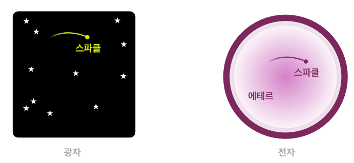

## 가설 제시

본 문서는 하나의 의문에서 출발한다. 양자물리학에 따르면 입자는 확률로서 존재한다. 그런데 왜 그 확률 공간에 의미를 두지 않는가? 혹시 그 공간이 입자의 일부라면 어떠할까?

 

<strong>가설</strong> 확률공간을 입자의 일부로 보는 시각

### 이중슬릿 실험의 이해

전자의 [이중슬릿 실험](https://ko.wikipedia.org/wiki/%EC%9D%B4%EC%A4%91%EC%8A%AC%EB%A6%BF_%EC%8B%A4%ED%97%98)을 가설에 맞추어 재구성해보자. 이 유명한 실험은 파장이자 입자인 입자의 이중성을 잘 보여준다. 전자는 두 슬릿을 동시에 통과하지만, 관측을 한다면 두 슬릿 중 한 곳에서만 존재한다. 최종적으로 이는 회절무늬를 형성한다.

 

<strong>이중슬릿 실험의 가설 적용</strong> 전자의 공간은 분리가 가능하다

전자가 공간이라는 가설을 적용하면 전자의 공간이 두 슬릿에 의해 분리가 되었다고 가정할 수 있다. 전자라는 공간은 우리가 공간이라 부르는 삼차원 좌표계에서 두 개로 나뉘었지만, 관측 시점에서 입자는 한 곳에서만 나타난다. 이것은 전자의 공간이 두 개로 나누어질 수 있음과 동시에 해당 공간 속의 입자는 두 개의 공간을 동일한 공간처럼 행동한다고 해석할 수 있다. 회절무늬가 나타난다는 것은 두 개의 공간이 모두 입자를 포함한다는 것을 의미하기 때문이다.

정리하자면, 입자의 공간은 분리될 수 있으며, 입자는 물리적으로 분리된 두 공간을 자유로이 넘나들며, 입자의 관점에서 봤을 때는 여전히 한 공간에서 움직이고 있다. 그렇다면 전자의 공간은 우리가 아는 좌표계로서의 공간이 아닌 다른 무언가이다. 분리될 수 있지만 여전히 연결된 새로운 공간이다. 이를 에테르(`ether`)라 부르고, 우리가 이전에 입자라고 생각해왔던 것을 스파클(`sparkle`)이라 부르기로 하자. 확률 공간을 입자의 일부로 보는 가설은 이제 물질이 에테르와 스파클의 합성체라는 가설이 되었다.

 

<strong>이름을 지어주마</strong>: 에테르와 스파클

그렇다면 에테르와 스파클은 각각 어떤 성질을 가지고 있을까? 광자와 전자의 비교를 통해 유추해 보고자 한다. 입자이자 파동인 두 물질은 비슷한 성질을 가지고 있지만 질량과 속력이라는 측면에서 다른 성질을 보인다. 광자는 질량이 0이며 진공에서 빛의 속도를 가진다. 반면 전자는 질량을 가지고 있으며 광자와 같은 운동을 하지 않는다.

앞선 가설에서 전자는 공간을 가지고 있고 전자의 스파클은 그 공간 속에 속박되어 있다고 보았다. 그렇다면 광자는 공간이 없는 스파클이 아닐까? 이렇게 가정한다면 에테르는 질량을 가지며, 스파클을 광자, 혹은 그에 준하는 물질로 가정할 수 있다. 전자에서 에테르에 해당하는 광자의 활동 영역은 우주 전체이고 그 속력은 관성계와 상관없이 불변한다. 반면, 전자 속 스파클의 우주는 그가 속해있는 에테르이다. 질량에 묶여있는 스파클은 광자에 비해 더 느린 속력을 가질 것이다. 광자가 다른 물질에 비해 불변의 속력을 가진 것은 독립적 스파클이 우주라는 공간 속에서 가지는 특성일 것이며, 전자 속의 스파클은 전자 에테르 속에서 역시 동일한 성질로 존재할 것이다.

 

<strong>가설에 따른 광자와 전자의 차이</strong>

에테르와 스파클의 또 다른 특징은 관측 가능성에 있을 것이다. 과학은 지금까지 스파클만을 관측했다. 에테르의 존재를 가정한다면, 에테르는 질량을 가지고 있으나 관측 불가능한 것이 된다.
 
### 스파클 독립적 광자-에테르: 보어의 원자 모형에서

우리는 에테르와 스파클의 합성체로서의 물질과 에테르 독립적 스파클인 광자를 가정하였다. 그렇다면 광자의 반대 개념인 스파클 독립적 에테르가 존재할 수 있을지 의문을 가지게 된다. 관측 불가능하며 질량을 가진 물질이다.

스파클 독립적 에테르가 무엇인지 유추하기 위해 닐스 보어의 원자 모형을 살펴보도록 하겠다.

 

<strong>고전 물리학</strong>: 보어의 원자 모형

보어의 원자 모형에서는 특정 파장의 광자(에너지)를 흡수한 전자는 그 궤도가 n이라는 정수만큼 증가하며, 해당 파장의 광자를 방출할 때 궤도는 감소한다. 여기서 에테르 독립적 스파클인 광자가 질량을 가진 스파클 독립적 에테르로 변화하여 궤도 사이에 들어가는 것으로 생각의 틀을 바꿔보도록 하자.

 

<strong>에테르 가설로 본 보어의 원자 모형</strong>

광자라는 스파클은 해당하는 에너지만큼의 에테르, 즉 질량으로 전환되어 전자 궤도에 위치하게 되며, 그만큼 전자의 위치는 변화한다. 반대로 에너지를 방출할 때는 에테르가 스파클로 전환되어 광자의 형태로 빠져나오면서 전자의 위치가 변화한다. 원자가 광자를 흡수할 때 광자의 에너지만큼 질량으로 환원되어 관측 불가능한 에테르로 전자구름 사이에 위치한다는 뜻이다. 이 물질을 광자-에테르라 명명하기로 하자.

이후로는 광자-에테르의 성질을 탐구함으로 그 증명을 시도할 것이다. 전자가 흡수한 광자-에테르가 규칙적인 성질을 가지고 있다면 이를 증명할 수 있는 근거가 될 것이기 때문이다.

---

- 이전 문서: [목차](./README.md)
- 다음 문서: [가설의 검증(1): 고전 물리학](./energy.md)
