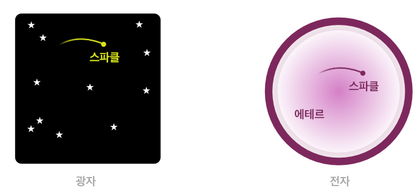

## Hypothesis

Every hypothesis starts with a question. A particle exists in probability. However, nobody applies more meaning on it. What if the space is a part of the particle?

 

<strong>Hypothesis</strong> Probability cloud would be a part of the particle

### Double-Slit Experiment

Let me reconstruct the [double-slit experiment](https://en.wikipedia.org/wiki/Double-slit_experiment) of an electron along with the hypothesis. This famous experiment shows the wave–particle duality well. The electron passes two slits at the same time, but it appears at one slit by the observation. After all, it produces a wave pattern.

 

<strong>Applying the hypothesis to the double-slit experiment</strong> The space can be divided

Applying the hypothesis, the probability cloud is a part of an electron, we can think the space of an electron is divided by the double-slit. Now, the space of an electron becomes two, but the particle can go around the two spaces. What the wave pattern means is the two spaces have a particle.

if so, the space of an electron is not same with the space we know. It's a new space that can be divided but connected together. I name this space as `ether`, and what we thought as a particle is a `sparkle`. The hypothesis, which recognizes the probability cloud is a part of a particle, becomes the hypothesis that the matter is a compound of the ether and sparkle.

 

<strong>Name it!</strong>: ether and sparkle

So, what is the nature of ether and a sparkle? Let me analogize with a photon and an electron. The two matters have a similar characteristic, both a particle and wave, but they are different in mass and speed. The weight of the photon is zero, and it has the speed of light in vacuum. In contrast, the electron has a mass, and it doesn't move like the photon.

The hypothesis explains that the electron has a space, and the sparkle is bond to the space. Therefore, I guess the photon is a standalone sparkle which doesn't have any ether. Following this idea, I can assume the ether has a mass, and the sparkle is a photon or similar material. The photon-sparkle's space is a universe, and the speed of it is unchangeable. Yet, the universe of the electron-sparkle is electron-ether, so the sparkle is bond to the mass. Thus, it has a lower speed. The nature of the photon and electron is from the space of each sparkles.

 

<strong>The differences between the sparkle and electron</strong>

Another difference between the ether and sparkle would be the observability. Science has observed the sparkle. Assuming the existence of the ether, the ether has a mass but does not have the observability.
 
### Standalone Ether, The Photon-Ether: from the Bohr model

I have assumed the matter is the ether-sparkle compound and the photon is a standalone sparkle. It is natural to have a question about the existence of standalone ether: the thing which is not observable and has a mass.

Let me reanalyze the Bohr model to guess what it is.

 

<strong>Classic Physics</strong>: Bohr model

According to the Bohr model, an atom absorbs a certain amount of energy with increment its orbit by integer n, and releasing energy acts the opposite way. What if I changed this model to a mass goes in between the orbits? Let me reconstruct this model to the standalone sparkle turns into the standalone ether and goes between the orbit.

 

<strong>Reconstruction Bohr Model by Ether-Sparkle Hypothesis</strong>

A sparkle(photon), morphs into the ether(mass) along with its energy and places into the orbit, so the position of the electron would be increased. On the other hand, when the ether turns into the sparkle, the position of the electron decreased. When the atom absorbs the photon, it becomes a mass and placed into the electron cloud. I name it to the photon-ether.

To the next chapter, I explore the nature of photon-ether to prove my hypothesis. It would be a small proof if the photon-ether has a certain characteristic.

---

- Prev Chapter: [Introduction](./intro_en.md)
- Next Chapter: [Proof(2): Multi-Electron Atoms](./atomic_spectra_data_en.md)
